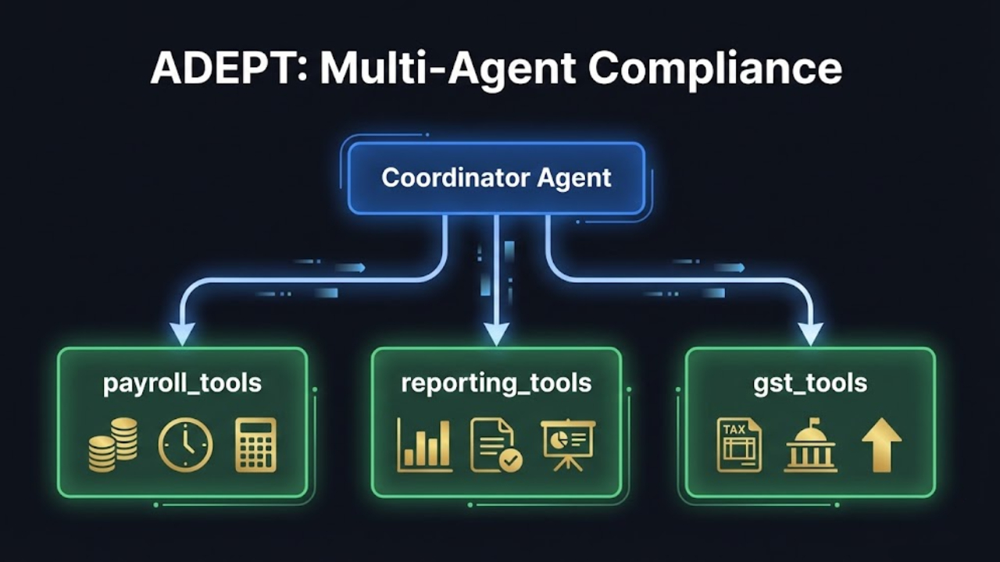
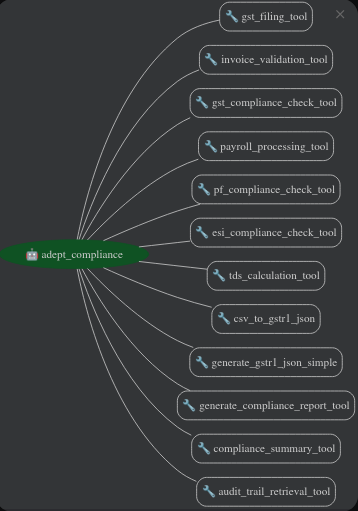

## Project Overview - Agent ADEPT

The AI-powered multi-agent compliance platform ADEPT revolutionizes the way Indian SMEs handle compliance workflows, payroll processing, and GST filing.  ADEPT uses Google's Agent Development Kit to deploy specialized agents that use domain-specific tools and autonomously reason.

These agents include coordinators, GST specialists, payroll processors, and reporting analysts.  Agents play a key role in the solution: while specialists carry out intricate tasks like GSTR-1 JSON generation and invoice validation, the coordinator intelligently routes queries.  By providing conversational compliance, this agent-driven architecture lowers filing times and error rates.

ADEPT is a prime example of innovation for the Enterprise track: meaningful AI that provides scalable, useful value that addresses actual operational issues facing SMEs.



### Problem Statement

One major obstacle facing India's 63 million SMEs, which are the backbone of the country's economy, is the time-consuming, error-prone, and operationally taxing nature of mandatory regulatory compliance (GST, PF, ESI, TDS).  Every month, finance teams devote 15 to 20 hours to compliance, using resources that could be used to expand core business operations.  The SME owner must coordinate the entire end-to-end process, including juggling several portals, manual reconciliation, and exception handling, because automation tools are still dispersed and passive.  The real operational bottleneck is this ongoing cognitive overhead, which includes managing deadlines, identifying necessary data, and resolving supplier mismatches.  SMEs are exposed to fines and operational inefficiencies as a result of current solutions' failure to transition from reactive automation to proactive, autonomous task orchestration.

### Solution Statement

Agentic AI advances to proactive task orchestration from passive tools.  Using Google's Agent Development Kit, ADEPT creates a hierarchical multi-agent system in which a coordinator oversees specialized agents for data, payroll, and GST, each of which uses domain-specific tools and autonomous reasoning.  ADEPT's agents proactively manage end-to-end workflows, including retrieving invoice data, reconciling GST filings, calculating PF/ESI deductions, and handling exceptions, as opposed to SME owners manually coordinating compliance across disparate platforms.  ADEPT learns user preferences, remembers problematic suppliers, and sends proactive reminders by utilizing ADK's SessionService and Memory Bank.  By turning compliance from a multi-day manual bottleneck into a conversational, intelligent process, this autonomous orchestration produces quantifiable enterprise ROI.

### Architecture
ADEPT uses Google's Agent Development Kit (ADK) to hierarchically orchestrate specialized agents that autonomously reason and invoke domain-specific tools to turn complex SME compliance workflows into conversational interactions. The architecture follows a coordinator-specialist pattern, where intelligent routing ensures each compliance task reaches the most capable agent equipped with the right tools.



The adept_agent intelligently coordinates and orchestrates the system.  It analyzes natural language queries, classifies intent (GST filing, payroll processing, reporting, or exceptions), and assigns tasks to sub-agents using ADK's multi-agent framework.

The adept_agent manages the compliance workflow lifecycle, multi-turn conversation context, and follow-up queries by remembering previous state.  It crucially facilitates agent-to-agent communication, sharing context and results between specialists to complete complex, multi-step compliance operations.

ADK's session management keeps user state while the agent reasons and decides with Gemini 2.0 Flash.

**GST Specialist: `gst_tools`**

Tax compliance includes filing returns, invoice validation, and compliance checking by the GST specialist agent.  It validates GSTIN formats and tax calculations, generates filing summaries, checks invoice data integrity, HSN code correctness, and place-of-supply rules, and processes batches of invoices.  Compliance monitoring tracks filing status, deadlines, and regulatory alerts, ensuring SMEs never miss important dates.  This sub-agent independently applies validation rules and escalates exceptions.

**Payroll Analyzer: `payroll_tools`**

Salaries are processed by the payroll specialist agent, including gross-to-net calculations, PF and ESI deductions per Indian labor laws, and TDS computations.  Employee master data, latest statutory rates, bank transfer files, salary slips, and payroll reports are maintained.  This sub-agent handles mid-month joiners, salary revisions, and statutory updates independently.

**The Reporter: `reporting_tools`**

By combining GST filings, payroll processing, and regulatory status data, the reporting specialist agent creates comprehensive compliance reports.  It generates financial statements, audit trails, management dashboards, and regulatory submissions.  This sub-agent turns raw transaction data into actionable insights and audit-ready documentation for SME owners to assess compliance health.

### Essential Tools and Utilities

There are several other tools alongside the specialized subagents.

**Conversation State Manager (`conversation_context`)**

Handles multi-turn conversations and follow-up questions.  This tool retrieves pending actions, combines new input with saved parameters, and completes workflows when users provide incomplete information (e.g., "50 invoices" after being asked for count).  It tracks expected inputs, last queries, and pending operations for natural conversation.

**GST JSON Generator (`analyze_codebase`)**

ADEPT's most innovative tool generates GST-compliant GSTR-1 JSON files.  It automates a manual, error-prone process by building complex nested JSON structures (B2B, B2CL, CDNR sections) from GSTIN, filing period, and invoice count.

**Memory Manager (`memory_tools`)**

Implements ADK's Memory Bank for persistent learning across sessions.  It remembers problematic suppliers, preferred filing patterns, and user-specific configurations.  Over time, it enables ADEPT to proactively suggest corrections, warn about historically problematic vendors, and personalize the compliance experience based on each SME's operational patterns.

### Conclusion

ADEPT uses intelligent agent orchestration to revolutionize enterprise compliance.  SMEs engage with a single conversational interface where specialized agents independently manage intricate workflows, as opposed to juggling numerous portals and manual reconciliation.  The system eliminates human error-prone processes by intelligently learning from user patterns, proactively flagging issues, and producing official GST-compliant JSON files.  Natural follow-ups are made possible by multi-turn conversations, and problematic suppliers and preferences are retained in session memory.  This smooth, clever experience demonstrates that agentic AI is a paradigm shift that is changing how businesses handle operational compliance, not just automation.

As a result, compliance becomes effortless, intelligent, and conversational.

### Value Statement

A 2025 TeamLease RegTech report states that the annual compliance costs for Indian MSMEs are between ₹13 and 17 lakhs, with finance teams devoting 15 to 20 hours per month to GST compliance alone among more than 1,450 regulatory obligations. Two to three days are needed each month for manual payroll processing. This is changed by ADEPT, which uses automated validation and one-click JSON generation to reduce GST filing time from 15–20 hours to less than 2 hours.  Automated PF/ESI computations reduce payroll processing from days to minutes.  SMEs eliminate ₹50,000–₹2,000,000 in annual penalty costs from manual errors while reclaiming more than 200 hours per year, rerouting human capital from compliance drudgery to core business growth.

In order to improve production reliability and user trust, I intend to incorporate human-in-the-loop validation workflows, implement multi-company support for CA firms managing multiple clients, and integrate real-time GST portal APIs for live filing status.

## Installation

This project was built against Python 3.10.9.

It is suggested you create a vitrual environment using your preferred tooling e.g. conda or pipenv.

Install dependenies e.g. pip install -r requirements.txt

### Running the Agent in ADK Web mode

From the command line of the working directory execute the following command. 

```bash
adk web
```

### Running the Agent from the terminal

From the command line of the working directory execute the following command.

```bash
python main.py
```

## Project Structure

The project is organized as follows:

*   `Adept_Project/`: The main Python package for the agent.
    *   `adept_agent`: Contains the main `adept_agent` and orchestrates the sub-agents.
        *   `agent.py`: Defines the main `adept_agent` and orchestrates the sub-agents.
    
    *   `gst_tools.py`: Contains GST-specific operations including filing returns, invoice validation, and compliance checking.

    *   `gst_json_generator.py`: Generates official GSTR-1 JSON files for GST portal upload with ADK artifact support for web downloads.

    *   `payroll_tools.py`: Handles salary processing, PF/ESI calculations, and TDS computations.

    *   `reporting_tools.py`: Generates compliance reports, audit trails, and regulatory submissions.

    *   `memory_tools.py`: Implements persistent learning and user preference storage across sessions.

    *   `config.py`: Contains configuration for the agents, API keys, and system settings.

    *   `main.py`: The main entry point for running the ADEPT agent system.


## Workflow

The `adept_agent` follows this workflow:

1.  **Query Classification & Routing** ADEPT analyzes user input to classify compliance requests (GST, Payroll, Reporting) and routes them to appropriate agents or tools. It detects special keywords for operations like JSON generation, ensuring each query reaches the right component for optimal execution.

2.  **GST Filing & Invoice Processing:** The system processes invoice batches for monthly GST compliance, validating GSTIN formats, tax rates, HSN codes, and place-of-supply rules. It generates comprehensive filing summaries and compliance status reports for SMEs.

3.  **Official GSTR-1 JSON Generation:** ADEPT creates GST portal-compliant GSTR-1 JSON files with proper nested structures (B2B, B2CL, CDNR sections).

4.  **Multi-Turn Conversation Handling:** The system maintains user context across multiple exchanges, remembering pending actions and combining new input with saved parameters. This enables natural conversation flow without users repeating previous context.

5.  **Payroll Processing & Calculations:** ADEPT handles end-to-end salary processing including gross-to-net calculations, PF deductions (12%), ESI per labor laws, and TDS computations. It generates salary slips and payroll reports for regulatory filing.

6.  **Compliance Monitoring & Status Checking:** The system tracks GST deadlines and regulatory requirements, generating status summaries and identifying compliance issues before they become penalties. It alerts users and provides corrective action recommendations.

7.  **Multi-Agent Orchestration:** A coordinator agent delegates tasks to specialized sub-agents for GST, Payroll, and Reporting. The system manages inter-agent communication and aggregates results into unified responses for the user.

8.  **Conversational Interface & Output Formatting:** ADEPT converts complex compliance workflows into simple natural language conversations. Results are delivered via terminal, web chat, or downloadable files—making compliance accessible to non-technical SME owners.
